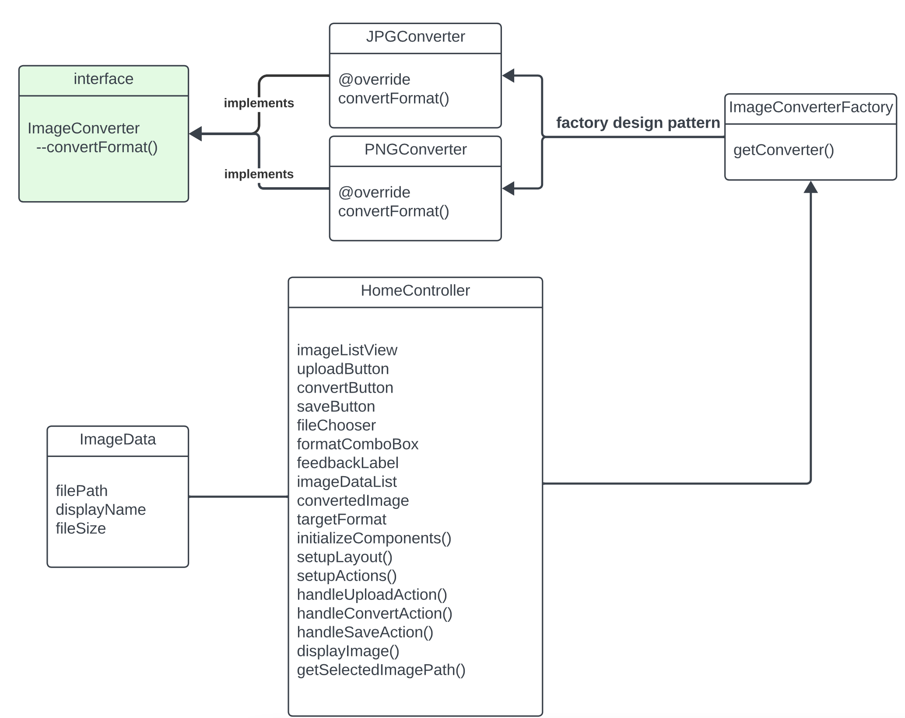

# JavaFX Image Management Tool

## Author
Shiyun Yu
002874255

## Description
This JavaFX application is an image management tool that allows users to upload images, apply basic filters, convert them to different formats, and save the converted images to a desired location.

## Features
- Upload images from the local file system.
- Display thumbnails and basic properties of the uploaded images.
- Convert images to different formats (PNG, JPG).
- Save the converted images to a user-specified location.

## How to Run
To run this application, you need to have Java and JavaFX installed on your system.
1. Clone this repository.
2. Navigate to the project directory.
3. Compile and run the application using your IDE or command line tools.

## Class Diagram
Below is the class diagram representing the main components of the application:
